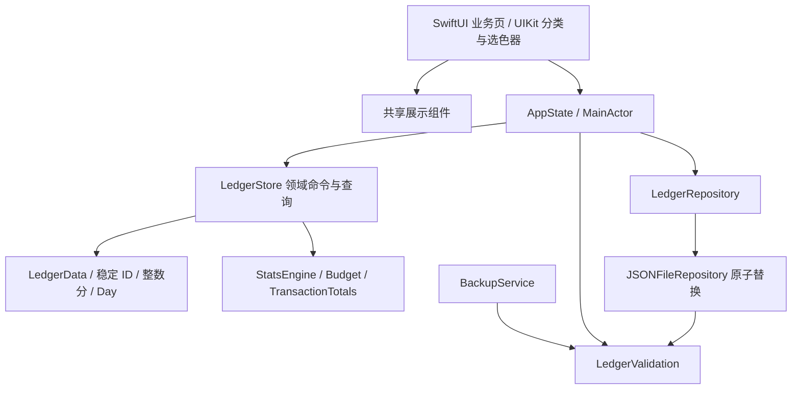

# 余记架构与扩展指南

更新：2026-09-11。描述仓库当前实现，不将计划中的 iCloud 同步当作现有功能。

## 1. 层次与依赖

`YujiCore` 仅依赖 Foundation。原生目标依赖本地 Swift Package，不依赖第三方 UI/存储包。UIKit 仅用于 SwiftUI 不易精确控制的本地交互：分类按行分页与原生挪位、系统选色器、分享。不要为复用引入与领域无关的通用表单引擎。

## 2. 状态归属

| 状态 | 唯一持有者 | 生命周期/写入方式 |
| --- | --- | --- |
| 账本、账户、分类、交易、预算、草稿、外观 | `LedgerData`，由 `LedgerStore` 持有 | 整体快照持久化；外部模块只读 data |
| 当前账本 | `LedgerData.activeLedgerID`；AppState 发布镜像 | `switchLedger` 经统一保存，重启恢复 |
| 流水与统计期间 | `AppState.browsingPeriod` | 会话状态；切账本回本月；不写 JSON |
| 今天 | `AppState.today` + 注入 dayProvider | 系统跨日/回前台刷新；测试冻结 |
| 所在 Tab/录入 sheet | RootView | 会话状态；正中 Tab 是动作 |
| 统计分类、排行顺序、明细展示上限 | CategoryAnalysisView | 同页局部状态；账本/期间 key 重建 |
| 未提交分类/预算/账户表单 | 页面 @State / Binding | 用户点保存后才变更领域 |
| 文字焦点/键盘/退出确认 | 当前表单 | 生命周期内，不进领域模型 |
| 排序过程与分页 | InlineCategoryStrip.Coordinator | UIKit 本地变化，手势结束一次提交 ID 排列 |
| 保存失败/恢复阻断/撤销 | AppState | 统一发布；失败不冒充成功 |

不要在 View 中写文件，不把 UI 临时筛选存成领域字段，也不要让两个根页面各自维护“当前期间”。业务页可计算格式和布局，不复制收支统计公式。

## 3. 领域模块

| 模块 | 责任 |
| --- | --- |
| Models / LedgerData | 稳定 ID、日期、交易、目录、schema、设置、领域错误 |
| LedgerStore | 账本/账户/交易命令、余额、删除恢复、幂等、批量、草稿 |
| LedgerStore+Categories | 两级分类和历史标签命令、排序置换、引用保护 |
| LedgerStore+Budgets | 月/年账本与分类预算规则提交、生效历史 |
| CategoryExperience / TagCatalog | 默认选择与目录查询；历史兼容 |
| LedgerBrowsing | 筛选、TransactionTotals、账本累计概览 |
| Stats / StatsExploration | 自然期间比较、分类构成、变化贡献、下钻交易 |
| Budget | 预算规则模型、解析、选取有效额度、预览与超额排序 |
| BrowsingPeriod | 本月/本年/固定月年/范围/全部；流水和统计截止差异 |
| Money / Calculator | 整数分、CNY 格式、十进制表达式和舍入 |
| Theme | 主题枚举、sRGB 对比与深浅色调节；无 UIKit 依赖 |
| LedgerValidation | 全库结构和关系完整性；本地读写、恢复共用 |
| Persistence / CSVExporter | JSON 原子保存、完整备份校验、表格安全转义 |

没有机械地为每个页面新建 Store 或 ViewModel。现有体量用一个 MainActor 状态入口，按领域职责拆扩展文件，减少重复控制流。批量操作内部先试运行/预检，再整批提交。

## 4. 写入、回滚与恢复

正常写入顺序：

1. `AppState.perform` 拒绝重复保存或存储阻断状态，保存旧 `LedgerData` 快照。
2. 执行一个或多个领域命令；领域局部条件不满足则抛可解释错误。
3. `LedgerValidation.validate` 校验整个结果；不允许页面组合命令留下悬空引用。
4. `LedgerRepository.save`；JSON 实现再次校验作为独立边界，编码到同目录唯一临时文件，再 replace/move。
5. 成功更新发布状态/提示；失败恢复旧 Store 与当前账本，表单只有 true 才 dismiss。

JSON 双重验证有意保留：AppState 支持注入其他仓储，JSON 也能独立使用。500 条数据规模成本已在回归中观察；以后性能数据证明瓶颈再合并验证凭证，不能直接移除完整性边界。

读取错误不自动改名或覆盖原文件，不写“已隔离”但忽略实际移动失败。`storageFailure` 阻止常规写入/导出；RootView 进入恢复页，可重试。恢复备份始终先校验：正常库保存完整恢复点；损坏库先复制原始文件字节；副本保存失败则不替换。新主文件保存成功后才替换内存。恢复点目录与当前文件同级，名为 `<filename>.restore-points`。

原子文件替换保护完整文件可见性，不声明断电场景下硬件持久性或多进程并发协调已经验证。当前是单进程 MainActor 写入；不能让未来 Widget、扩展或云同步各自直接保存同一个 JSON 文件。

## 5. 数据契约与兼容

当前 schema 为 3，读取支持已定义的 1～3 数据布局，新增可选字段按默认值兼容。`JSONEncoder` 使用 ISO8601 时间、稳定排序键。交易金额是正整数分，类型决定影响方向；退款使用独立交易并引用原支出。交易稳定 ID 与 operationID 不因编辑改变；软删除不移除记录。导入时检查 ID 唯一、operationID 唯一、revision 合法。

归档实体是合法历史引用。新增交易可用性校验与全库历史完整性不能混为一套：若用“当前可选”校验所有历史，会使归档目录后的备份无法恢复。相反，损坏备份中的跨账本引用、非法日期、无原支出退款、重复预算规则不能通过。

金额合计用溢出检查设定安全边界，校验必须先于备份合计计算，避免构造数据引发 Int64 溢出。日期使用当前时区下公历日历，不受用户选择其他日历制导致年份变化；交易日期作为 Day 保持业务日不随展示格式转换。

旧 tagIDs 保留于历史、兼容分析与备份，不再有标签编辑/选择页面。删除未调用的原生 TagPicker 和 CategoryChip，保留历史领域模型/测试。新需求不得复活第二套分类概念。

备份 checksum 是数量与收支合计核对，不是加密摘要。恢复替换全库，不是合并。不从 CSV 重建完整关系。

## 6. 共享组件契约

| 组件 | 输入/输出与复用范围 |
| --- | --- |
| PeriodNavigation + PeriodPicker | Binding<BrowsingPeriod>、today、日期边界、ID 前缀；流水/统计共用完整头部，无页面样式分支 |
| TransactionRow | 交易、是否显示日期；从环境只读目录/主题；流水、统计共用 |
| LedgerFormatting / StatsRangeLabel | 整数分/Day/范围/比较状态 → 统一文本；含明确舍入的保存文案 |
| CategorySymbol | CategoryNode 或旧名称 → 本地白名单 SF Symbol，失败回退通用图标 |
| InlineCategoryStrip | 目录 ID、当前选中、主题、排序回调；UIKit 不直接持久化或计算推荐 |
| CategoryEditorView | 同一个新增/编辑表单；领域保存成功返回 ID，调用方决定选择该分类 |
| BudgetFields / LedgerBudgetEditor | 账本+分类规则统一编辑；只有提交时写入 |
| StatsBudgetView / EntryBudgetHint / CategoryBudgetSummary | Stats/Entry 公用预算解释，入参显式携带期间/截止/预览 |
| AmountText / SolidActionStyle / CleanSheetSurface | 统一数字适配、主按钮、表面与深浅色 |
| FormExitGuard | isDirty + requested；页内继续/放弃，页面负责先收键盘 |
| ThemeSettingsSections / AppAccentModifier | 外观设置入口、全局强调色、原生桥接颜色一致 |

分类拖动的 CADisplayLink 会持有 Coordinator；`dismantleUIView` 显式取消移动并释放刷新回调，不能只依赖 deinit。异步 UI 回调使用弱引用，页面销毁后不继续修改旧集合。

共享不等于所有表单完全相同：新建录入关闭保留草稿、修改记录取消需确认、预算编辑暂存、备份恢复替换确认是不同语义。不要抽成只有一个布尔“保存/退出”的通用组件而丢失区别。

## 7. 后续扩展步骤

### 新增统计维度或图表

先明确分母、退款归属、截止日期、空/负/零状态；在 Core 增加纯查询与守恒测试；UI 复用 PeriodNavigation、TransactionRow、同页筛选状态。明细取数和主指标必须使用相同过滤口径。不能创建单独日期状态或复制收益计算。

### 新增领域字段或交易类型

修改 Codable 默认解码、共享校验、命令、备份/CSV、金额聚合与迁移测试；保持稳定 ID。新增交易类型需穷举账户影响、统计、预算、退款/删除、显示语义。schema 变更必须附旧数据恢复用例，不在 View 中修补导入数据。

### 新增主题或分类图标

主题扩展 `AccentTheme` 和对比测试，UIKit 只消费统一已解析颜色。图标扩展 `CategoryIcon` 白名单并跑原生符号可用性测试。不要用每次进程变化的 Swift hashValue 为分类配色；图表已有稳定字符串映射。

### 引入 iCloud/多人共享

参见后续[方案](icloud-sharing-plan-2026-09-10.md)。当前文件仓储不能直接改成“把 JSON 放 iCloud Drive”。需要实体级同步、zone/share 权限边界、持久化待发送队列、账号切换隔离、幂等回放和冲突策略；并发退款额度、删除与离线重放必须重新设计并验收。AppSettings 中的旧 icloudEnabled 字段不代表连通，UI 固定显示未开放。

### 扩大数据量或支持后台写入

目前完整快照读写、数组查询，适合已验证的 500 条夹具。不能将 500 次查询耗时推断成 50,000 条流畅。先做设备上 5k/50k 的保存延迟/内存/主线程测量，再评估索引、SQLite/SwiftData 与 actor 仓储。新增异步写入必须设计取消、失败后状态顺序和相同版本提交，不让旧快照覆盖新数据。

## 8. 测试与交付

macOS Swift Package 复用同一个 AppState 文件，并排除 `YujiTests/Native` 目录中的 UIKit 测试；iOS 单元目标包含真实 UIKit 渲染检查。新加 UIKit 测试放入 Native 目录，避免纳入 macOS portable target。

`TestSupport.useIsolatedFixture` 为每个 UI 测试生成 UUID，冻结业务日；重启测试复用同一个 UUID。`scripts/regress.sh` 给 hosted unit test 也注入隔离路径，并使用每次运行独立 manifest，不触碰个人账本。仅 DEBUG 且 UUID 合法时启用；显式测试参数非法则拒绝启动，不回退个人仓储。正式构建走默认仓储。

优先审查所有保存调用点是否检查成功、日期/金额/分类是否共用规则、状态修改是否经 perform。测试结果、原生截图和已知边界见[回归记录](regression-2026-09-11.md)。发布仍需要真实签名、隐私/图标/商店材料和目标设备验收。
