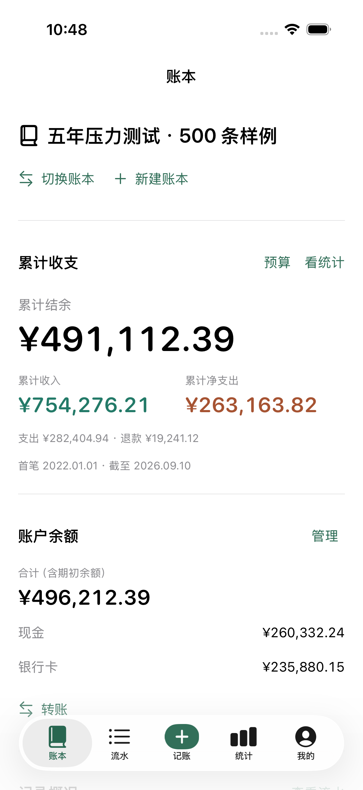
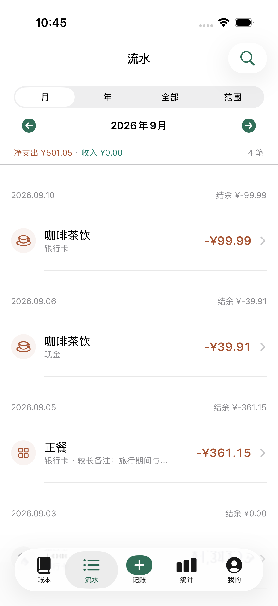
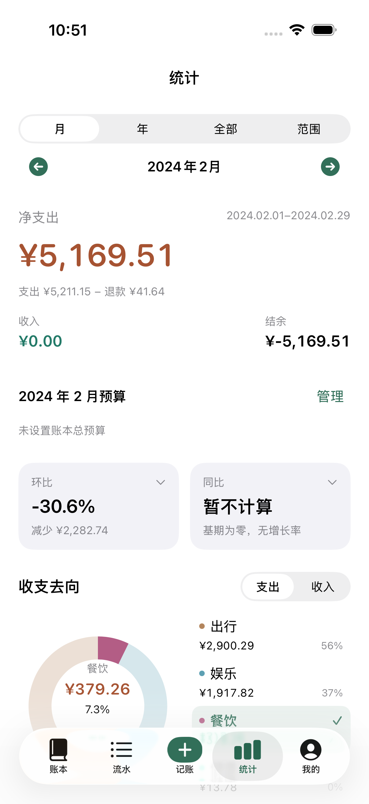
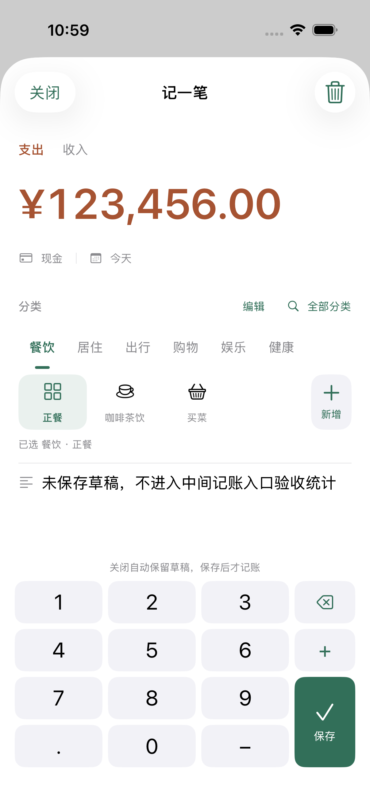
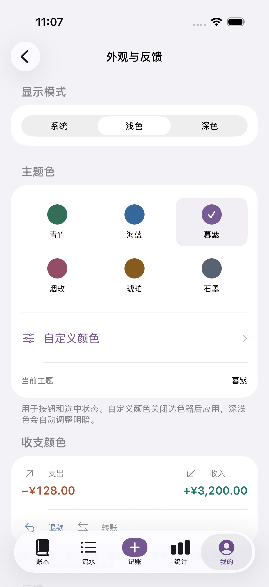
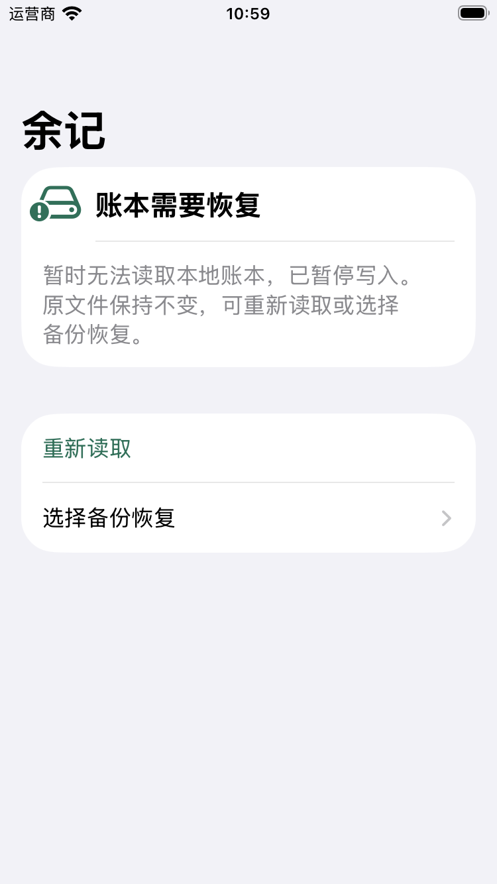

# 当前原生页面 · 2026-09-11

92 张原始模拟器截图来自隔离合成数据与空账本；可在本地打开 [完整图集](index.html) 筛选页面和设备。图集覆盖 iPhone 17 Pro 与 iPhone SE 3，包含深色和最大字号；[清单](manifest.json) 记录测试来源和图片哈希。

### 账本累计

### 流水统一时间

### 统计同页筛选

### 记账录入

### 主题设置

### 异常恢复

