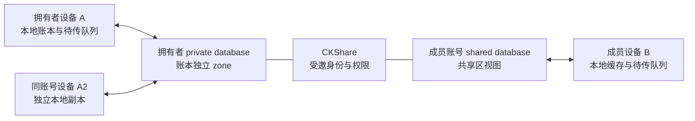

# 余记 iCloud 同步与共享账本方案

调研日期：2026-09-10。状态：**架构与产品方案，尚未启用云端同步、创建 CloudKit 容器或上传用户账本**。当前原生工程仍使用本地 JSON 仓库，最低 iOS 16、开发团队配置为空；现有模拟器结果不证明多账号云端协作可用。

## 可行性与推荐

事实：同一 Apple 账号的设备可以访问对应的 CloudKit 私有数据库；不同账号可以用 CKShare 邀请共享。共享记录由拥有者的 private database 保存，参与者从自己的 shared database 访问同一份记录。[Apple 共享说明](https://developer.apple.com/documentation/CloudKit/shared-records)、[官方共享示例](https://developer.apple.com/documentation/CloudKit/sharing-cloudkit-data-with-other-icloud-users)。

研判：采用 **本地优先 + CloudKit 私有同步 + 按账本 CKShare 共享**。不新增余记注册、密码、好友系统或自建组队服务器。“没有额外服务端存储”可以理解为不运营自己的服务；CloudKit 本身仍是 Apple 的云端存储与权限服务，离线只保证本地可用。

| 场景 | 用户操作 | 数据与身份 |
| --- | --- | --- |
| 纯本地 | 直接记账 | 不要求 iCloud，不上传 |
| 同一账号的多台 iPhone | 各设备登录同一系统 iCloud 账号，选账本开启同步 | 同一 private database；这些设备不是不同团队成员 |
| 不同账号共同记账 | 拥有者邀请，对方接受 | CKShare 成员身份；拥有者 private、参与者 shared |
| 同账号下既有个人账本也有家庭账本 | 每个账本分别选择存储方式 | 个人账本不因开启另一个账本共享而被公开 |
| 一人参加多个家庭/旅行账本 | 分别接受邀请 | 一个账号可属于多个 share；不以账本名称匹配 |
| 系统没有可用 iCloud 账号 | 保持本地，提示前往系统设置 | App 不代替系统登录，也不能在自己的账号面板切换系统 iCloud |

无需再加“通过 Apple 登录”来完成 CloudKit 同步。CloudKit 使用系统 iCloud 身份；第三方 App 的登录身份不是选择另一套 iCloud 数据的开关。账号入口展示“iCloud 可用/未登录/暂不可用”和同步状态，避免承诺一定能取得 Apple ID 邮箱。身份读取和变化检测使用 CKContainer 的账号状态与用户记录标识。[账号状态 API](https://developer.apple.com/documentation/cloudkit/ckcontainer/accountstatus(completionhandler:))。

## 邀请、匹配与组队

**一个共享账本就是一个协作空间。** 首版不引入独立 Team、好友关系、群聊和房间码表。

1. 拥有者在「账本 → 共享」选择“邀请共同记账”，先展示将共享的范围：账本、账户、分类、流水、备注和预算；其他账本、个人设置与草稿不包含。
2. 确认后将本账本同步至独立 record zone，保存 CKShare 后取得邀请 URL。上传失败时保留本地，不显示“已开启共享”。
3. 采用系统共享管理界面，默认“仅受邀者”，设置查看或可编辑；由用户选消息渠道发邀请。助手不会自动代发邀请。
4. 对方点击链接，系统将 share metadata 交给余记；展示账本与邀请信息，接受成功并完成首次拉取后才加入账本列表。
5. 通过 `(container, environment, databaseScope, zoneID.ownerName, zoneID.zoneName, recordName)` 定位云记录。相同显示名称、昵称、手机号尾号不能作为合并键。
6. 重复接受同一邀请只打开已有账本。不能因重试创建新的账本 ID。首次拉取应经过引用校验，再让账本进入可编辑状态。

Apple 提供 `UICloudSharingController` 管理邀请、参与者和权限；接收邀请需要 `CKSharingSupported`、场景/应用代理回调和接受分享操作。推荐先保存 share，再使用 `init(share:container:)`，不采用文档中已弃用的 preparation 初始化方式。[共享控制器](https://developer.apple.com/documentation/uikit/uicloudsharingcontroller)。

| 用户概念 | 存在哪里 | 是否能作为授权依据 |
| --- | --- | --- |
| 账本拥有者、参与者、读写权限、接受状态 | CKShare 系统记录 | 是，以 CloudKit 当前返回及写入结果为准 |
| 家庭/旅行名称 | 共享账本元数据 | 否，只是显示信息 |
| 邀请链接 | CKShare.url | 它是定位入口；私有邀请仍需系统验证受邀身份 |
| 昵称、头像颜色、成员显示偏好 | 本地，或后续共享资料记录 | 否，不能通过改昵称升级权限 |
| 本机同步进度、待传记录、冲突副本 | 本地按云账号隔离的数据库 | 否，不代表远端已经确认 |

研判：链接可编码为二维码方便当面扫码，但二维码不增加权限。六位组队码需要可查询的“短码 → 邀请”目录、冲突处理、失效和反枚举规则；纯 private/shared 数据库没有面向陌生人的全局检索目录。若以后坚持短码，可以评估 CloudKit public database，但那会增加公共目录与权限设计，不在本方案首版中。

Apple 家庭共享关系不等于账本访问权限；不能把“属于同一个 Apple 家庭”当作已经接受 CKShare。首版统一使用显式邀请。

## 权限、退出与拥有权

| 身份 | 首版能力 |
| --- | --- |
| 拥有者 | 邀请、移除成员、改权限、停止共享；编辑账本数据 |
| 可编辑成员 | 访问并修改分享范围内的记录；修改分类和预算也会影响所有成员 |
| 只读成员 | 查看与分析；不展示记账、预算保存及数据管理写入口，写操作还须接受 CloudKit 权限校验 |

事实：有写权限的参与者能够改、删共享记录。[Shared Records](https://developer.apple.com/documentation/CloudKit/shared-records)。因此“只允许改自己的流水”“预算只有管理员可改”“不可篡改操作日志”不能靠客户端隐藏按钮保证。**研判：首版面向相互信任的小组，权限明确限定为账本级只读/读写。** 严格细粒度权限或防恶意篡改，需要重新拆分分享范围或引入可信服务端校验，不能宣传为已有能力。

- 成员退出：停止获取此 share，处理未同步改动后移除本地共享缓存。离开只影响其参与身份；不能把普通记录删除当作退出操作。
- 拥有者移除成员：CloudKit 撤销后续访问。离线设备只有下次联网才知道；已经看过、导出或截图的数据无法远程收回。
- 拥有者停止共享：保留自己的私有账本；参与者失去访问。先说明影响范围，不能把关闭本机同步等同于删除 share。
- 拥有者退出/注销 iCloud：共享可用性依赖该账号及数据状态。首版不提供“转让拥有权”按钮；如需交接，设计为明确导出/复制成新拥有者的账本后重新邀请，不能假定改本地 ownerID 即完成转让。
- 共享数据的存储计入原拥有者 iCloud 配额，应处理配额不足，保持本地待同步并说明拥有者需释放空间。[CKDatabase.Scope.shared](https://developer.apple.com/documentation/cloudkit/ckdatabase/scope/shared)。

## 数据结构与同步路径

研判：一账本一个自定义 zone，整 zone 共享，比把全部账本放一个大 zone 后靠 UI 隐藏更容易审计隔离。

| 数据 | 云端表示/本地职责 |
| --- | --- |
| 账本、账户、分类 | 独立 CKRecord，保持现有稳定 ID |
| 每笔流水 | 一个记录；转账的转出/转入字段保留同一记录，避免上传半笔转账 |
| 预算 | 每个分类范围、月/年与生效周期独立记录；全账本额度用独立范围，避免多人修改不同预算时整数组覆盖 |
| 删除/归档 | 带版本的删除标记或归档状态；首版不轻易清除删除标记，避免离线旧设备复活已删除数据 |
| 同步元数据 | 云记录 system fields/changeTag、最后共同版本、本地 operationID、云账号/环境、每数据库同步引擎状态 |
| 个人草稿、界面设置 | 首版留本机；不会因共享账本自动分享草稿与偏好 |

不能直接把现有 `ledger.json` 放 iCloud Drive，让多台设备互相覆盖完整文件。这种方式不能可靠合并两个人同时新增的流水，也无法表达逐账本成员权限。保留现有领域模型，但新增记录级映射、合并层和持久化待传队列。

建议模块边界：

- `CloudAccountSession`：账号可用性、用户记录标识、切换事件和本地存储命名空间。
- `CloudLedgerRepository`：逐记录映射与本地缓存；和当前本地仓库同样受领域校验约束。
- `CloudSyncCoordinator`：private/shared 分别一套同步引擎，持久化引擎状态与待传业务操作。
- `LedgerSharingCoordinator`：创建分享、接受邀请、成员管理和退出；不自己维护第二份权限真相。
- `ConflictResolver`：共同祖先、本地、远端三方比较；保留冲突副本。
- `SyncStatusView`：已在本机保存/待同步/已上传/需要处理，不用一个绿色对勾混称所有状态。

Apple 的 CKSyncEngine 可以分别连接 private/shared database，负责调度与部分临时错误重试；持久化与业务冲突仍由应用负责。[WWDC23 CKSyncEngine](https://developer.apple.com/videos/play/wwdc2023/10188/)。其官方示例要求 iOS 17 系列及以上。[示例及前置条件](https://github.com/apple/sample-cloudkit-sync-engine)。

研判：首版云能力要求 iOS 17+，iOS 16 继续提供当前本地功能；不立即更改整个 App 的最低版本。若必须支持 iOS 16 云同步，再比较 Core Data CloudKit 或手写变更拉取，不维护两套同步实现来追求表面兼容。

## 换账号与离线：必须先保数据

事实：CKSyncEngine 在账号变化后会重置内部状态，包括未提交的变更，应用需要自己处理本地持久化。[AccountChange](https://developer.apple.com/documentation/cloudkit/cksyncengine-5sie5/event/accountchange)。

研判：本地用 `(container, environment, iCloudUserRecordID)` 隔离云账户仓库，并保留独立的纯本地仓库。系统账号 A 换成 B 后：

1. 先停 A 的同步，持久化尚未发送的业务操作与冲突副本，不能只依赖引擎待传状态。
2. 隐藏 A 的共享数据，切到 B 的独立缓存；不上传 A 的记录到 B，也不清空用户的纯本地账本。
3. 重新校验 B 的账号状态、分享权限与云数据。A 的未传操作只可在 A 重新登录后对账恢复。
4. 不把账号不可用、网络失败、配额不足和分享被撤销混成“重新上传全部”。尤其参与者遇到共享 zone 不存在时，不能自动在自己 private database 重建旧共享账本。
5. 被撤权期间产生的离线修改保留为隔离的未同步副本，停止写入并说明原因，不无限重试。

无网络时允许本地记账，标注“待同步”；成员权限只能基于最后确认的状态，最终写权限由联网后的 CloudKit 校验。不能承诺离线撤权即时生效。

## 冲突与财务约束

研判：先做确定性规则，不用“最新时间覆盖”解决所有冲突。手机时钟不可信，预算/金额冲突不能静默丢一方。

| 冲突 | 处理原则 |
| --- | --- |
| 两设备新增不同流水 | UUID/operationID 分离，各自保留；重试同一操作不重复记账 |
| 同笔不同字段 | 基于共同祖先做三方合并，合并后重新跑领域校验 |
| 同笔金额/分类/日期均被改 | 保留本地与远端差异，标为待解决；用户选择前不冒充全局同步完成 |
| 删除与编辑并发 | 保留删除标记及编辑副本，不能自动复活删除记录 |
| 两人创建同名分类 | 身份仍以 ID 区分；检测重名后做显式合并/改名，不根据名称自动吞掉流水引用 |
| 同范围预算并发编辑 | 以范围与生效周期定位同一云记录，条件保存，冲突交用户解决；不同范围不互相覆盖 |
| 修改规则、重新归类或退款 | 重新计算预算；预算不作为限制记账的锁 |

事实：`ifServerRecordUnchanged` 检查服务端 change tag，冲突返回 `serverRecordChanged`。[条件保存](https://developer.apple.com/documentation/cloudkit/ckmodifyrecordsoperation/recordsavepolicy/ifserverrecordunchanged)。同自定义 zone 的批量操作可设置原子提交，需按实际能力校验，不跨账本假定事务。[isAtomic](https://developer.apple.com/documentation/cloudkit/ckmodifyrecordsoperation/isatomic)。

例：原消费 ¥100，A、B 离线各退 ¥80，各自本地校验都能通过，合并后却变成 ¥160。拟采用原消费的版本控制/退款汇总记录，把汇总与退款放同 zone 条件原子提交；冲突方重新拉取验证，不通过则进入待处理，不能强行叠加。此算法仍需真实 CloudKit 实验验证；客户端可编辑权限不能抵御恶意绕过业务规则的客户端。

本地数据变更与待传队列必须一次持久化，远端确认后再标记完成。同步中断、进程被杀和响应丢失要可重放。整库备份恢复默认导入为新本地账本并预览，不能直接回滚所有成员共享数据。同步也不能代替独立备份。

## 方案比较与验证顺序

以“离线可靠记账、少操作加入协作、不运营自建服务”为目标，基于用户反馈做以下机会比较；没有伪造访谈或量化收益。

| 用户困难 | 比较的方案 | 选择与验证 |
| --- | --- | --- |
| 多设备数据不一致 | iCloud Drive 整文件 / Core Data CloudKit / 现有模型 + CKSyncEngine | 选择第三项，保留现有领域层。实验：两设备断网各新增 100 笔，联网后 ID 集、余额、预算完全一致且无丢失 |
| 家人加入步骤多 | 系统私有邀请 / 公开链接任何人加入 / 自定义短码目录 | 选择系统私有邀请。实验：不同账号接受、重复点击、错误账号与邀请撤销，均无串账和重复账本 |
| 不知道数据是否安全到云端 | 只显示总开关 / 明确本机与同步状态 / 强制联网才能记 | 选择状态清楚且离线可用。实验：断网、配额不足、杀进程与账号切换后，待传数据可恢复且不误报完成 |

交付顺序：

1. **准备与迁移设计**：配置签名、CloudKit 容器、iCloud/推送能力、开发与生产环境；旧本地账本默认不上传，先做转换副本和可回退验证。
2. **同账号同步**：实现记录映射、持久化待传、冲突副本和账号隔离。在两台真实设备/同账号验证后再开放开关。
3. **不同账号共享**：实现 zone share、邀请生命周期、成员管理、只读/读写和撤销；两账号双设备验证。
4. **可靠性关卡**：并发金额修改、并发退款、转账、分类归档、预算历史、重复回放、删除后旧机上线、token 失效、账号 A→B→A、被撤权的离线写入、同名不同 ID、备份导入隔离。
5. **发布准备**：部署生产 schema、真实分发版本验证邀请唤起和跨环境隔离；不能拿 Development 容器成功推断 TestFlight/生产成功。

待核实：实际开发团队/容器权限、两个可用测试 iCloud 账号、真实设备上的邀请路由与系统权限界面、目标版本下 zone 原子操作和配额错误行为。这些是云能力进入实现/发布阶段的验收输入，不阻碍本轮本地分类预算交付。
